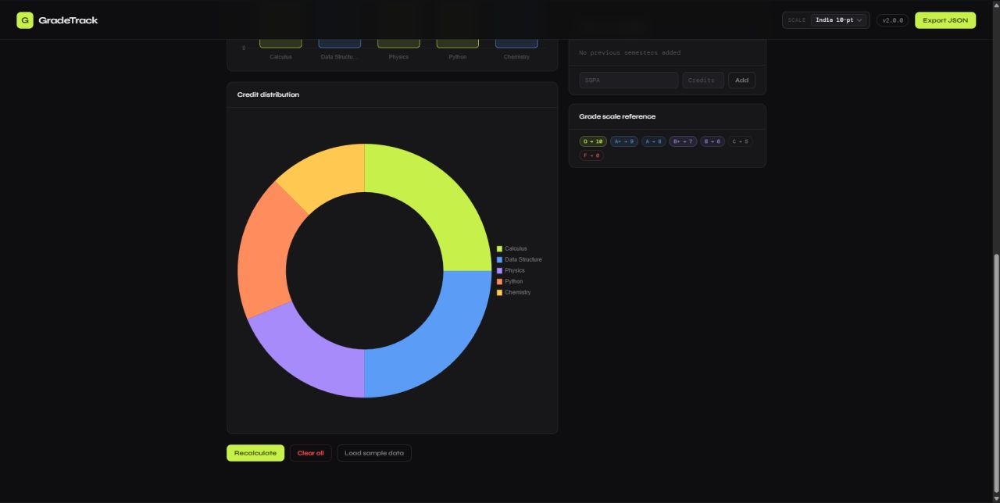
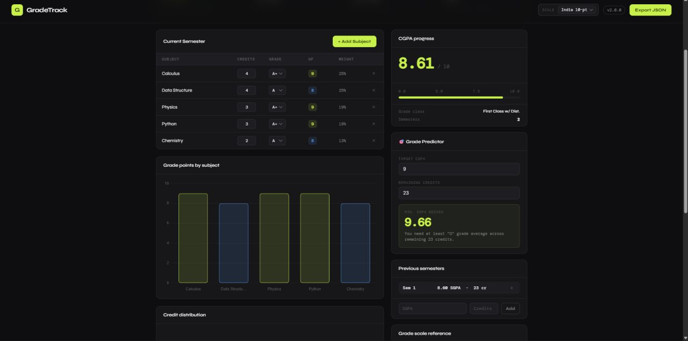
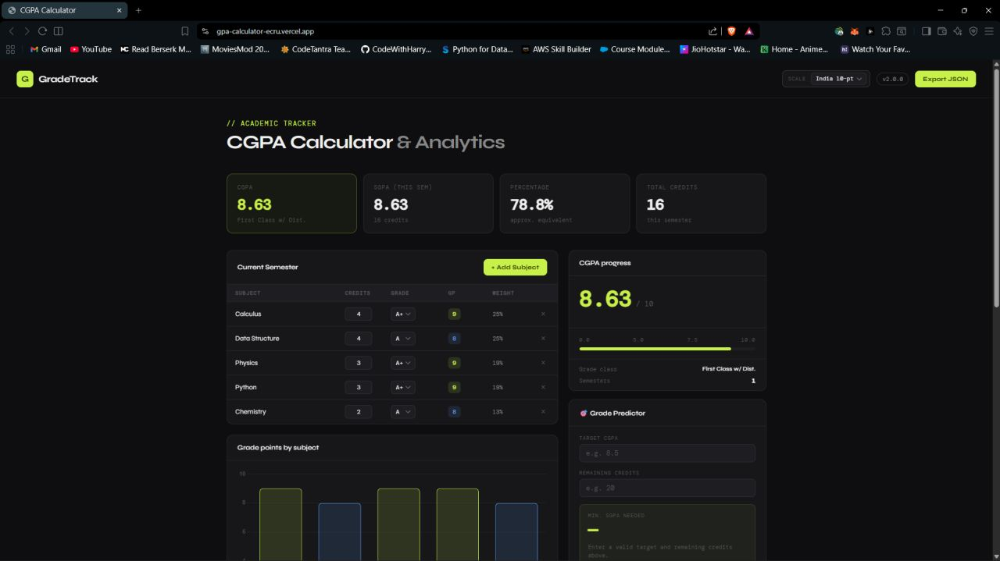

<div align="center">

# 📊 GradeTrack

**A clean, multi-scale GPA & CGPA calculator for students**

[](https://developer.mozilla.org/en-US/docs/Web/HTML)
[](https://developer.mozilla.org/en-US/docs/Web/CSS)
[](https://developer.mozilla.org/en-US/docs/Web/JavaScript)
[](https://www.chartjs.org/)
[](LICENSE)
[](https://gpa-calculator-ecru.vercel.app)

[🔗 Live Demo](https://gpa-calculator-ecru.vercel.app) · [🐛 Report a Bug](https://github.com/varundev-exe/gpa-calculator/issues) · [✨ Request a Feature](https://github.com/varundev-exe/gpa-calculator/issues)

</div>

---

## Overview

GradeTrack is a browser-based tool that lets students calculate their **Semester GPA (SGPA)** and **Cumulative GPA (CGPA)** across multiple grading systems. Add your subjects, enter credits and grades, and instantly see your performance metrics.iertnfjkhgoiergjsfiow

> Built as a first-year college project using vanilla HTML, CSS, and JavaScript.

---

## Features

- **SGPA & CGPA Calculation** — Add subjects dynamically with name, credit hours, and grade point
- **Multi-Scale Support** — Switch between three grading systems:
  - 🇮🇳 India 10-Point Scale
  - 🇺🇸 US 4.0 Scale
  - 🇬🇧 UK Honours Classification
- **Grade Predictor** — Enter a target CGPA and see the minimum grade point needed in upcoming semesters
- **Previous Semesters Tracker** — Log past semester GPAs to compute a running CGPA
- **Visual Charts** — Bar chart (per-subject grade points) and doughnut chart (grade distribution) via Chart.js
- **Export to JSON** — Download your session data as a `.json` file for records
- **Load Sample Data** — One-click demo to explore features without manual entry
- **Responsive Design** — Works on desktop and mobile

---

## Screenshots

### Main Calculator Interface


### Grade Calculation and Predictor


### Credit Distribution Chart


### Full Dashboard View


---

## Getting Started

### Prerequisites

No installations or dependencies needed. Just a modern browser.

### Run Locally

```bash
# 1. Clone the repository
git clone https://github.com/varundev-exe/gpa-calculator.git

# 2. Open the project folder
cd gpa-calculator

# 3. Open index.html in your browser
#    On macOS:
open index.html
#    On Linux:
xdg-open index.html
#    On Windows: double-click index.html in File Explorer
```

Or use the [Live Demo](https://gpa-calculator-ecru.vercel.app) directly — no setup needed.

---

## How to Use

1. **Select a grading scale** from the dropdown at the top
2. **Add subjects** using the `+ Add Subject` button
3. Enter each subject's **name**, **credit hours**, and **grade point**
4. Hit **Recalculate** to see your SGPA and updated CGPA
5. Use the **Previous Semesters** section to track past semesters for a cumulative CGPA
6. Try the **Grade Predictor** by entering a target CGPA — it tells you the minimum score needed
7. **Export** your data as JSON for safekeeping, or **Clear All** to start fresh

---

## How the Math Works

### SGPA (Semester Grade Point Average)

$$\text{SGPA} = \frac{\sum(\text{Grade Point}_i \times \text{Credits}_i)}{\sum \text{Credits}_i}$$

Each subject's grade point is weighted by its credit hours, then divided by the total credits.

### CGPA (Cumulative GPA across semesters)

$$\text{CGPA} = \frac{\sum(\text{SGPA}_i \times \text{Credits}_i)}{\sum \text{Credits}_i}$$

Each semester's SGPA is weighted by the total credits of that semester.

### Grade Predictor

Rearranging the CGPA formula for the required score in future semesters:

$$\text{Required Score} = \frac{(\text{Target CGPA} \times \text{Total Future Credits}) - \sum(\text{Past SGPA}_i \times \text{Past Credits}_i)}{\text{Remaining Credits}}$$

---

## Grading Scales Reference

| Scale | Max | Description |
|-------|-----|-------------|
| India 10-Point | 10.0 | Most Indian universities (UGC/AICTE) |
| US 4.0 | 4.0 | Standard US college GPA |
| UK Honours | 4.0 (mapped) | First / 2:1 / 2:2 / Third |

---

## Tech Stack

| Technology | Purpose |
|------------|---------|
| HTML5 | Structure and markup |
| CSS3 | Styling and responsive layout |
| JavaScript (ES6) | All calculation logic and DOM manipulation |
| [Chart.js](https://www.chartjs.org/) | Bar and doughnut charts |
| [Google Fonts – Syne](https://fonts.google.com/specimen/Syne) | Heading typography |
| [Google Fonts – DM Mono](https://fonts.google.com/specimen/DM+Mono) | Monospace / numeric display |

---

## File Structure

```
gpa-calculator/
├── index.html      # Main app — markup and embedded styles
├── script.js       # All calculation and interaction logic
├── .gitignore
├── LICENSE
└── README.md
```

---

## Roadmap

- [x] SGPA & CGPA calculation
- [x] Multiple grading scale support
- [x] Grade predictor
- [x] Chart visualizations (bar + doughnut)
- [x] JSON export
- [x] Previous semesters tracker
- [ ] `localStorage` persistence (data survives page refresh)
- [ ] Import from JSON
- [ ] CGPA trend line chart across semesters
- [ ] PDF / image export of results
- [ ] Dark / light theme toggle

---

## Contributing

Contributions, bug reports, and feature suggestions are all welcome!

```bash
# 1. Fork the repository
# 2. Create a new branch
git checkout -b feature/your-feature-name

# 3. Make your changes and commit
git commit -m "Add: your feature description"

# 4. Push to your fork
git push origin feature/your-feature-name

# 5. Open a Pull Request on GitHub
```

Please keep PRs focused — one feature or fix per PR makes review much easier.

---

## License

Distributed under the MIT License. See [`LICENSE`](LICENSE) for details.

---

<div align="center">

Made by [Varun](https://github.com/varundev-exe) · ⭐ Star the repo if you found it useful!

</div>
